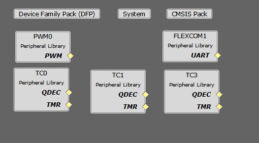

# PMSM FOC using Quadrature Encoder with SAMRH71-EK and LX7720 boards

This example shows how to perform motor control using the SAMRH71-EK board connected to the LX7720 board. The control strategy is the sensored FOC, in which rotor position is determined by the Quadrature Encoder and speed is calculated from the position. 

## Description
Permanent Magnet Synchronous Motor (PMSM) is controlled using Field Oriented Control (FOC). Rotor position and speed is determined from quadrature encoder in LX7720. Motor start/stop operation is controlled by the switch and motor speed can be changed by the on-board potentiometer. Waveforms and variables can be monitored at runtime using X2CScope. 

Key features enabled in this project are:

- Dual shunt current measurement
- Speed control loop

## MPLAB Harmony Configurations 

* PWM Peripheral:
    * This peripheral is used to generated three phases synchronous PWM waveforms. Fault functionality is also enabled to switch off the output waveforms asynchronously
* TC Peripherals:
    * TC0
        * Channel 0 to trigger periodic PWM duty updates.
        * Channel 1 to trigger periodic interrupt for current sampling in TC3.
    * TC1
        * This peripheral is used in quadrature encoder mode for position measurement
    * TC3
        * Used for sampling the sigma delta modulators signals from LX7720 board.

* FLEXCOM Peripheral:
    * The UART is used for X2CScope communication to observe graphs and variable values in run time.

## Algorithm and current measurement

The control algorithm is the same as in the PMSM using an Encoder based Field Oriented Control (FOC) in the SAME70 microcontroller example

An additional algorithm is used to get the currents on phase A and B from the LX7720. A decimation filter is used to convert the sigma delta modulators output from LX7720.

### Current conversion with decimation filter

The second order sigma delta modulator output of the LX7720 is a noise shaped signal where le low frequency noise is pushed toward the high frequencies.

The SAMRH71 provide a 25MHz clock to the LX7720 modulator which in turn generates modulated signals that can be sampled by the SAMRH71.

The sampling is done with one timer counter per motor phase (A and B). The timer counters use two channels clocked at 50MHz. For each channel we use the "Burst signal" selection to have respectively XC0 (TCLK3) or (TCLK4) XC1 ANDed with the counting clock. The channel 0 of the same timer is used as reference to trigger a periodic interrupt for sampling, here every 4µs. This first sampling act as first SINC1 filter with OSR1=50.

A digital third order CIC filter (also known as SINC3) is used to do anti-aliasing filtering and decimate to the desired data-rate​. This filter is applied on every SINC1 samples (OSR2=5).
With this configuration we get SINC3 samples every 20µs which corresponds to 2.5 samples per PWM periods.

The final calculation for phases A and B currents is performed in the FOC control interrupt routine. The currents are calculated with a weighted average on the last 4 samples.

The FOC control loop is executed in an interrupt routine generate by a timer counter. This counter starts when the PWM event signal is raised. Then the interrupt is triggered after 20µs using the timer compare mode. This ensures that we have at least one current SINC3 sample calculated before the weight average calculation.

## Development Kits

### SAM RH71 Evaluation Kit and LX7720 Daughter Board
#### Downloading and building the application

To clone or download this application from Github, go to the [main page of this repository](https://github.com/Microchip-MPLAB-Harmony/mc_apps_sam_rh71) and then click **Clone** button to clone this repository or download as zip file.
This content can also be downloaded using content manager by following these [instructions](https://github.com/Microchip-MPLAB-Harmony/contentmanager/wiki).

Path of the application within the repository is **apps/pmsm_foc_encoder_lx7720_sam_rh71_ek** .

To build the application, refer to the following table and open the project using its IDE.

| Project Name      | Description                                    |
| ----------------- | ---------------------------------------------- |
| sam_rh71_ek.X | MPLABX project for SAM RH71 Evaluation Kit and LX7720 Daughter Board |
|||

[Hardware Setup and Running The Application on SAM RH71 Evaluation Kit  with LX7720 Daughter Board](../docs/sam_rh71_ek_board_lx7720_db.md)